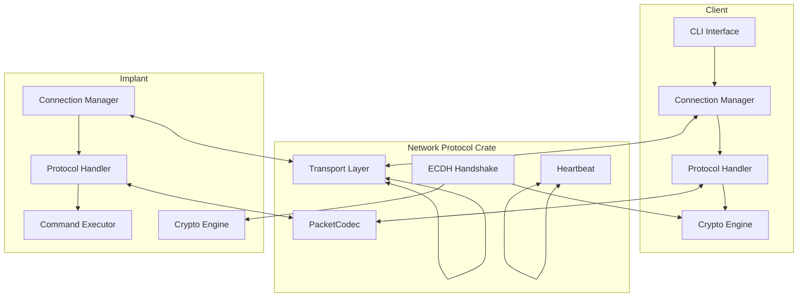
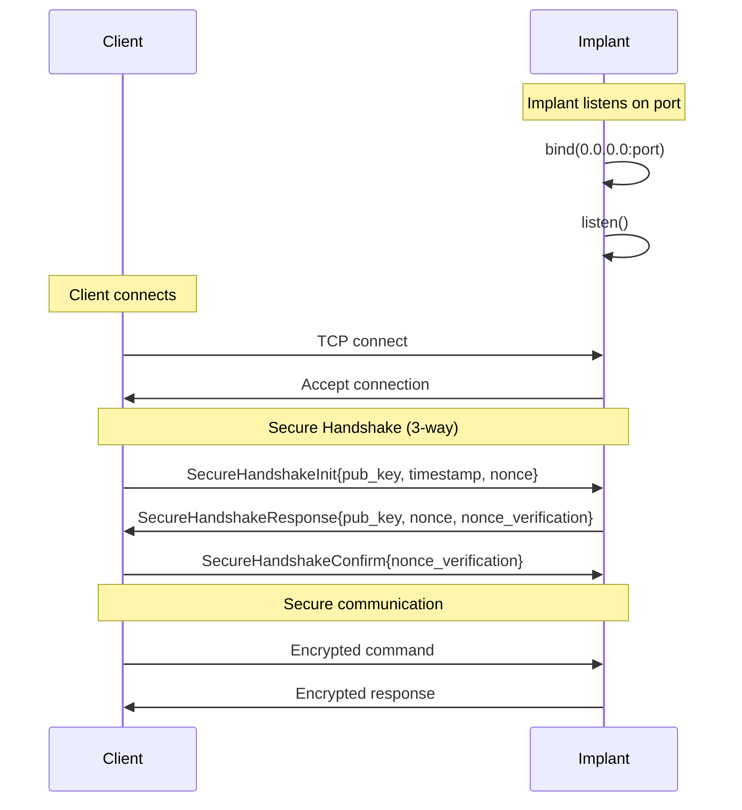
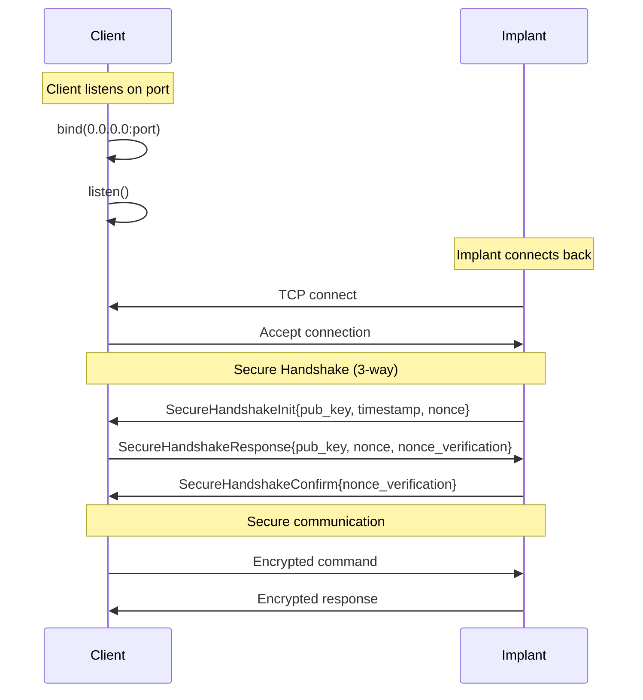

# Design Document

## Overview

The core networking protocol implementation provides secure, encrypted communication between Ghost_Monkey client and implant components using the `network-protocol` crate. The design leverages the network-protocol crate's secure handshake mechanism (ECDH key exchange with nonce verification and timestamp-based replay protection) and supports both call-in and callback connection modes for maximum flexibility in different network environments.

The architecture follows a layered approach:

- **Transport Layer**: TCP connections using [network-protocol](https://docs.rs/network-protocol/1.0.0/network_protocol/)'s transport abstraction
- **Protocol Layer**: Secure handshake (ECDH + nonce verification), message serialization, and heartbeat mechanisms
- **Application Layer**: Command execution and response handling
- **Security Layer**: Encryption and authentication as provided by network-protocol's secure handshake

## Architecture

### High-Level Architecture



### Connection Modes

#### Call-in Mode (Traditional)



#### Callback Mode (Firewall Evasion)



## Components and Interfaces

### Core Components

#### 1. Transport Manager

```rust
/// Manages network connections using network-protocol transport layer
pub struct TransportManager {
    transport: Box<dyn Transport>,
    config: TransportConfig,
}

impl TransportManager {
    /// Create new transport for call-in mode (client connects to implant)
    pub async fn new_client(address: SocketAddr) -> Result<Self>;

    /// Create new transport for callback mode (implant connects to client)
    pub async fn new_server(bind_addr: SocketAddr) -> Result<Self>;

    /// Send packet using network-protocol PacketCodec
    pub async fn send_packet(&mut self, packet: Packet) -> Result<()>;

    /// Receive packet using network-protocol PacketCodec
    pub async fn recv_packet(&mut self) -> Result<Packet>;
}
```

#### 2. Protocol Handler

```rust
/// Handles protocol-level operations including handshake and message processing
pub struct ProtocolHandler {
    codec: PacketCodec,
    security: SecurityManager,
    heartbeat: HeartbeatManager,
}

impl ProtocolHandler {
    /// Perform ECDH handshake using network-protocol's handshake module
    pub async fn perform_handshake(
        &mut self,
        transport: &mut TransportManager,
        is_initiator: bool,
    ) -> Result<()>;

    /// Send encrypted command message
    pub async fn send_command(
        &mut self,
        transport: &mut TransportManager,
        command: &str,
    ) -> Result<()>;

    /// Receive and decrypt response message
    pub async fn recv_response(
        &mut self,
        transport: &mut TransportManager,
    ) -> Result<CommandResponse>;

    /// Handle heartbeat messages using network-protocol's heartbeat module
    pub async fn handle_heartbeat(&mut self, transport: &mut TransportManager) -> Result<()>;
}
```

#### 3. Security Manager

```rust
/// Manages secure communication using network-protocol's built-in security
pub struct SecurityManager {
    handshake_complete: bool,
    session_established: bool,
}

impl SecurityManager {
    /// Create new security manager
    pub fn new() -> Self;

    /// Initiate secure handshake (client side)
    pub async fn initiate_handshake(&mut self, transport: &mut TransportManager) -> Result<()>;

    /// Respond to handshake (server side)
    pub async fn respond_handshake(&mut self, transport: &mut TransportManager) -> Result<()>;

    /// Check if secure session is established
    pub fn is_secure(&self) -> bool;

    /// Send secure message (encryption handled by network-protocol)
    pub async fn send_secure_message(
        &self,
        transport: &mut TransportManager,
        message: &Message,
    ) -> Result<()>;

    /// Receive secure message (decryption handled by network-protocol)
    pub async fn recv_secure_message(&self, transport: &mut TransportManager) -> Result<Message>;
}
```

#### 4. Command Executor (Implant-side)

```rust
/// Executes commands safely on the implant system
pub struct CommandExecutor {
    allowed_commands: HashSet<String>,
}

impl CommandExecutor {
    /// Create executor with restricted command set
    pub fn new() -> Self;

    /// Execute command if allowed, return output
    pub async fn execute(&self, command: &str) -> Result<CommandResponse>;

    /// Validate command against allowlist
    fn is_command_allowed(&self, command: &str) -> bool;
}
```

### Message Types

#### Protocol Messages

```rust
/// We'll use network-protocol's built-in Message enum for handshake:
/// - SecureHandshakeInit { pub_key: [u8; 32], timestamp: u64, nonce: [u8; 16] }
/// - SecureHandshakeResponse { pub_key: [u8; 32], nonce: [u8; 16], nonce_verification: [u8; 32] }
/// - SecureHandshakeConfirm { nonce_verification: [u8; 32] }
/// - Custom { command: String, payload: Vec<u8> } for our application messages
/// - Ping/Pong for heartbeat

/// Our application-level message types (sent as Custom message payload)
#[derive(Debug, Clone, Serialize, Deserialize)]
pub enum AppMessage {
    /// Command execution request
    Command { command: String },

    /// Command execution response
    Response {
        success: bool,
        stdout: String,
        stderr: String,
        exit_code: Option<i32>,
    },

    /// Error message
    Error { message: String },
}

/// Command execution result
#[derive(Debug, Clone)]
pub struct CommandResponse {
    pub success: bool,
    pub stdout: String,
    pub stderr: String,
    pub exit_code: Option<i32>,
}
```

## Data Models

### Configuration Models

#### Transport Configuration

```rust
/// Configuration for network transport
#[derive(Debug, Clone)]
pub struct TransportConfig {
    /// Bind address for server mode
    pub bind_addr: SocketAddr,

    /// Connection timeout
    pub connect_timeout: Duration,

    /// Read/write timeout
    pub io_timeout: Duration,

    /// Enable TLS transport
    pub use_tls: bool,

    /// Maximum packet size
    pub max_packet_size: usize,
}

impl Default for TransportConfig {
    fn default() -> Self {
        Self {
            bind_addr: "0.0.0.0:8080".parse().unwrap(),
            connect_timeout: Duration::from_secs(30),
            io_timeout: Duration::from_secs(60),
            use_tls: false,
            max_packet_size: 1024 * 1024, // 1MB
        }
    }
}
```

#### Security Configuration

```rust
/// Cryptographic configuration
#[derive(Debug, Clone)]
pub struct SecurityConfig {
    /// Heartbeat interval
    pub heartbeat_interval: Duration,

    /// Maximum message size before chunking
    pub max_message_size: usize,

    /// Connection idle timeout
    pub idle_timeout: Duration,
}

impl Default for SecurityConfig {
    fn default() -> Self {
        Self {
            heartbeat_interval: Duration::from_secs(30),
            max_message_size: 4096,                 // 4KB as per requirements
            idle_timeout: Duration::from_secs(300), // 5 minutes
        }
    }
}
```

### State Models

#### Connection State

```rust
/// Connection state machine
#[derive(Debug, Clone, PartialEq)]
pub enum ConnectionState {
    /// Initial state
    Disconnected,

    /// TCP connection established
    Connected,

    /// ECDH handshake in progress
    Handshaking,

    /// Handshake complete, ready for secure communication
    Authenticated,

    /// Connection error occurred
    Error(String),
}
```

## Error Handling

### Error Types

```rust
/// Comprehensive error handling for all protocol operations
#[derive(Debug, thiserror::Error)]
pub enum ProtocolError {
    /// Network transport errors
    #[error("Transport error: {0}")]
    Transport(#[from] network_protocol::Error),

    /// Security/handshake operation errors
    #[error("Security error: {0}")]
    Security(String),

    /// Message serialization/deserialization errors
    #[error("Serialization error: {0}")]
    Serialization(#[from] serde_json::Error),

    /// Command execution errors
    #[error("Command execution error: {0}")]
    CommandExecution(String),

    /// Protocol violation errors
    #[error("Protocol violation: {0}")]
    ProtocolViolation(String),

    /// Timeout errors
    #[error("Operation timed out: {0}")]
    Timeout(String),

    /// Authentication/handshake errors
    #[error("Authentication failed: {0}")]
    Authentication(String),
}

/// Result type alias for protocol operations
pub type ProtocolResult<T> = Result<T, ProtocolError>;
```

### Error Recovery Strategies

- **Connection Errors**: Automatic reconnection with exponential backoff
- **Security Errors**: Terminate connection and require new handshake
- **Timeout Errors**: Graceful degradation with heartbeat recovery
- **Protocol Violations**: Log and continue with error response

## Testing Strategy

### Unit Testing

- **Security Manager**: Test handshake state management and secure message handling
- **Message Serialization**: Test AppMessage types with various payloads
- **Command Executor**: Test command validation and execution
- **Protocol Handler**: Test handshake sequences using network-protocol and message processing

### Integration Testing

- **End-to-End Communication**: Full client-implant communication tests
- **Connection Modes**: Test both call-in and callback modes
- **Error Scenarios**: Network failures, invalid messages, timeout handling
- **Security**: Verify encryption, key exchange, and authentication

### Property-Based Testing (Proptest)

```rust
proptest! {
    #[test]
    fn test_app_message_serialization_roundtrip(msg in any::<AppMessage>()) {
        let serialized = serde_json::to_vec(&msg)?;
        let deserialized: AppMessage = serde_json::from_slice(&serialized)?;
        prop_assert_eq!(msg, deserialized);
    }

    #[test]
    fn test_secure_message_handling(data in prop::collection::vec(any::<u8>(), 0..1024)) {
        // Test secure message handling using network-protocol's security
        let security_manager = SecurityManager::new();
        // ... test secure message operations with various payloads
    }
}
```

### Snapshot Testing (Insta)

- **Message Formats**: Snapshot test serialized message formats
- **Protocol Flows**: Capture and verify protocol interaction sequences
- **Error Messages**: Ensure consistent error message formatting

### Fuzzing Tests

```rust
#[cfg(test)]
mod fuzz_tests {
    use super::*;

    #[test]
    fn fuzz_message_parsing() {
        // Fuzz message deserialization with random bytes
    }

    #[test]
    fn fuzz_secure_operations() {
        // Fuzz secure message handling with malformed inputs
    }
}
```

### Benchmarking (Criterion)

```rust
use criterion::{Criterion, black_box, criterion_group, criterion_main};

fn benchmark_protocol_operations(c: &mut Criterion) {
    c.bench_function("secure_message_send_1kb", |b| {
        let data = vec![0u8; 1024];
        let security_manager = setup_security_manager();
        b.iter(|| security_manager.send_secure_message(black_box(&data)))
    });

    c.bench_function("handshake_complete", |b| {
        b.iter(|| {
            let mut security_manager = SecurityManager::new();
            // Benchmark handshake completion using network-protocol
            security_manager.initiate_handshake(black_box(&mut transport))
        })
    });
}

criterion_group!(benches, benchmark_protocol_operations);
criterion_main!(benches);
```

## Implementation Phases

### Phase 1: Core Infrastructure

1. Set up project structure with Cargo.toml dependencies
2. Implement basic Transport Manager using network-protocol
3. Create message types and serialization
4. Set up comprehensive testing infrastructure (nextest, insta, proptest, criterion)

### Phase 2: Security Foundation

1. Implement SecurityManager using network-protocol's secure handshake
2. Integrate with network-protocol's built-in ECDH handshake functions
3. Add comprehensive security testing and benchmarks
4. Implement secure message handling using network-protocol's encryption

### Phase 3: Protocol Implementation

1. Implement ProtocolHandler with handshake logic
2. Add heartbeat and keepalive mechanisms
3. Implement connection state management
4. Add error handling and recovery

### Phase 4: Application Layer

1. Implement CommandExecutor for implant
2. Create client and implant binary entry points
3. Add CLI argument parsing and configuration
4. Implement both call-in and callback modes

### Phase 5: Documentation and Polish

1. Complete rustdoc documentation for all public APIs
2. Set up mdbook with comprehensive tutorials
3. Add examples and usage guides
4. Performance optimization and security audit
