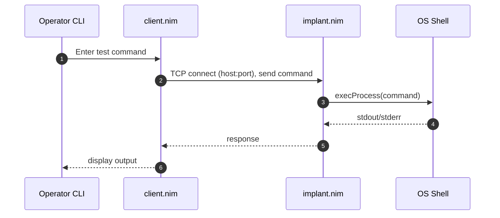

# AGENTS.md

This file provides guidance to AGENTS (AI coding assistants) when working with code in this repository.

## Purpose and Scope

Ghost_Monkey is an educational UNIX backdoor written in Nim, designed for authorized penetration testing and OSCP preparation. **This tool is strictly for educational purposes and authorized testing environments only.** Users are solely responsible for ensuring lawful use with explicit consent from system owners.

## High-Level Architecture

Ghost_Monkey implements a simple client-server backdoor pattern using TCP sockets. The system consists of two components that communicate via an unauthenticated socket protocol:

- **client.nim**: Interactive socket client that connects to the implant and forwards commands
- **implant.nim**: Socket server that executes received commands via `execProcess()` and returns output



**Architecture Notes:**

- Simple, unauthenticated TCP socket protocol
- No transport encryption (plain text communication)
- Command execution via Nim's `execProcess` function
- Both components use the `strenc` module (purpose unclear without inspection)

## Dependencies and Setup

### Requirements

- Nim ≥ 2.0 with nimble package manager
- `strenc` Nim package (installed via nimble)
- POSIX shell (Unix/macOS) or PowerShell (Windows)

### Installation

**Cross-Platform (Recommended):**

```sh
# Install Nim via choosenim (official installer)
curl https://nim-lang.org/choosenim/init.sh -sSf | sh
# Restart shell, then verify:
nim --version
nimble --version
```

**Windows (PowerShell):**

```powershell
# Option 1: Check winget first (preferred per project standards)
winget search nim
# If official Nim package available: winget install <PackageId>

# Option 2: Fallback to choosenim
iwr https://nim-lang.org/choosenim/init.ps1 -UseBasicParsing | iex
# Restart terminal, then verify:
nim --version
nimble --version
```

### Dependencies Installation

```sh
# Refresh package list and install required dependency
nimble refresh
nimble install -y strenc
```

### Verification

```sh
# Verify toolchain
nim --version
nimble --version
nimble list | grep -i strenc
```

**Security Note:** Do not run the precompiled binaries (`client`, `implant`) without verification. Always rebuild from source on your trusted machine.

## Common Development Commands

### Building (Debug Mode)

```sh
nim c client.nim
nim c implant.nim
```

### Building (Release Mode)

```sh
nim c -d:release client.nim
nim c -d:release implant.nim
```

### Static Analysis

```sh
nim check client.nim
nim check implant.nim
```

### Cleaning Build Artifacts

```sh
# Unix/macOS
rm -rf nimcache/ client implant client.exe implant.exe

# Windows (PowerShell)
Remove-Item -Recurse -Force nimcache, client.exe, implant.exe -ErrorAction SilentlyContinue
```

### Running (Lab Environment Only)

**Start implant:**

```sh
./implant [port]  # defaults to port 5555
```

**Connect with client:**

```sh
./client  # connects to 127.0.0.1:5555
```

## Project Structure

```text
/
├── client.nim          # Socket client for command interaction
├── implant.nim         # Socket server executing commands via execProcess
├── client              # Precompiled client binary (rebuild recommended)
├── implant             # Precompiled implant binary (rebuild recommended)
├── config.nims         # Nim compiler configuration
├── AGENTS.md            # This document
├── README.md          # Project overview
├── LICENSE            # Project license
├── .gitignore         # Git ignore patterns
├── justfile           # (Optional) Task automation
└── scripts/           # (Optional) Test harness scripts
    ├── test_local.sh   # Unix integration tests
    └── test_local.ps1  # Windows integration tests
```

**Key Files:**

- Both `.nim` files depend on the `strenc` module
- Precompiled binaries should be rebuilt from source before use
- All communication hardcoded to localhost (127.0.0.1:5555)

## Security Considerations and Safe Testing

### Ethical Use Requirements

- **Authorized testing only**: Use only in environments where you have explicit written permission
- **Educational contexts**: OSCP labs, personal test environments, authorized penetration testing
- **Legal compliance**: Users are responsible for following all applicable laws and regulations

### Lab-Only Operation

- **Loopback binding**: Always bind listeners to 127.0.0.1 for development and testing
- **Network isolation**: Use local firewalls/VLANs to isolate test traffic
- **No external exposure**: Never expose the implant to external networks during testing

### Principle of Least Privilege

- **Non-privileged execution**: Run both client and implant as non-privileged users
- **Minimal functionality**: Avoid adding persistence, privilege escalation, or stealth features
- **Command validation**: Treat all input as untrusted; consider command whitelisting for enhanced security

### Binary and Data Hygiene

- **Rebuild from source**: Always compile binaries on trusted machines rather than using precompiled versions
- **Test data handling**: Avoid logging sensitive information during tests
- **Secure storage**: Encrypt test logs at rest if they might contain sensitive content
- **Minimal retention**: Delete test outputs when no longer needed

## Testing Guidance

**Testing Philosophy**: All tests must run in isolated, loopback-only environments using benign commands.

### Unit Testing

- Use Nim's standard library `unittest` module for individual function testing
- Focus on testing helper functions if/when code is refactored into modules

### Integration Testing (Local-Only)

**Objective**: Verify end-to-end request/response flow on loopback with harmless commands

**Approach**:

1. Start implant on 127.0.0.1 with dynamically chosen ephemeral port
2. Connect with client and send benign command (e.g., `whoami`)
3. Assert non-empty response received
4. Cleanly terminate both processes

**Test Scripts** (to be implemented):

- `scripts/test_local.sh` (Unix/macOS)
- `scripts/test_local.ps1` (Windows)

### Continuous Integration

If adding CI pipelines, ensure:

- Tests run only in loopback mode
- No external network connectivity
- Clean teardown of all test processes

## Automation via justfile (Optional)

A `justfile` can streamline common development tasks while maintaining DRY principles:

```make
set positional-arguments := true

default:
    @just --list

# Lint justfile formatting
lint-just:
    just --fmt --check --unstable

# Install dependencies
deps:
    nimble refresh
    nimble install -y strenc

# Internal build helper (DRY principle)
_nimc src out:
    nim c -d:release -o {{out}} {{src}}

# Build individual components
build-client:
    @just _nimc client.nim client

build-implant:
    @just _nimc implant.nim implant

# Build all components
build-all:
    @just build-client
    @just build-implant

# Clean build artifacts
clean:
    rm -rf nimcache client implant client.exe implant.exe

[unix]
test:
    @just deps
    @just build-all
    ./scripts/test_local.sh

[windows]
test:
    @just deps
    @just build-all
    ./scripts/test_local.ps1
```

**Note**: Recipes use `@just <subrecipe>` calls to maintain DRY principles per project standards.

## Documentation Conventions

### Mermaid Diagrams

- **Standard**: All architecture and flow diagrams use Mermaid format
- **Placement**: Include directly in Markdown files for GitHub rendering
- **Style**: Prefer sequence diagrams for protocol flows, flowcharts for decision trees

### Markdown Formatting

- **Prettier exclusion**: Markdown files are intentionally excluded from Prettier formatting
- **Rationale**: Preserves Mermaid diagram formatting and custom documentation structure
- **Configuration**: Ensure `.prettierignore` contains:

  ```text
  *.md
  docs/**/*.md
  AGENTS.md
  ```

## Contribution and Review Process

### Code Changes Requirements

- **Testing mandatory**: All code changes must include appropriate tests
- **Local verification**: Run full test suite before submitting changes
- **Clean builds**: Ensure code compiles without warnings on target platforms

### Review Process

- **Primary reviewer**: Use coderabbit.ai for code review and feedback
- **No auto-reviews**: GitHub Copilot automatic reviews are disabled per project preference
- **Human oversight**: Maintainer review required for all changes

### Git Workflow

- **Branch protection**: Use feature branches for all non-trivial changes
- **Conventional commits**: Follow conventional commit format (e.g., `feat:`, `fix:`, `docs:`)
- **No auto-commits**: AI assistants must not commit or alter git workflow without explicit permission
- **Single maintainer**: Project operates with single maintainer model (UncleSp1d3r)

### Development Environment

- **VS Code**: Primary editor with Nim extension support
- **Cross-platform**: Ensure changes work on Windows, macOS, and Linux
- **Dependencies**: Pin Nim version if reproducible builds needed via choosenim

## Safety Reminders

1. **Never use in unauthorized environments**
2. **Always test on loopback (127.0.0.1) only**
3. **Rebuild binaries from source before use**
4. **Use non-privileged accounts for testing**
5. **Clean up test artifacts and logs**
6. **Follow responsible disclosure if issues found**

This document uses Mermaid for diagrams per project standards and is excluded from Prettier formatting to preserve structure and readability.
