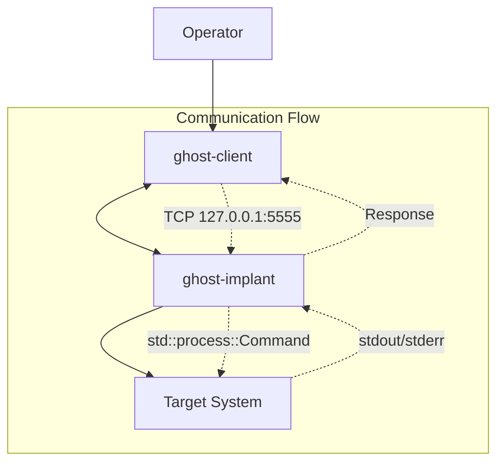
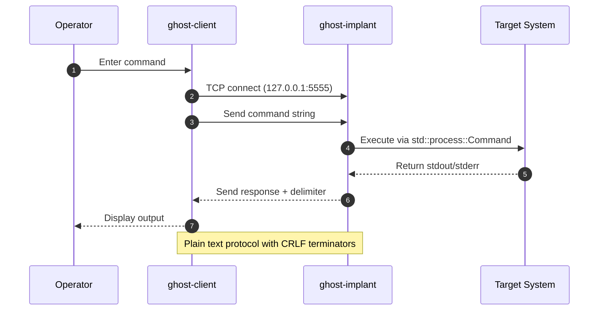

# AGENTS.md

This file provides guidance to AI Agents when working with code in this repository.

## Quick Start

Ghost_Monkey is an educational backdoor written in Rust for authorized penetration testing and OSCP preparation. The project implements a client-server architecture using TCP sockets for local command execution.

**Essential Commands:**

```bash
just setup              # Install toolchain and dependencies
just build               # Build debug binaries
just test                # Run all tests
just lint                # Run formatting and linting checks
just run                 # Start implant server (127.0.0.1:5555)
```

## Conventions and Guardrails

This project follows specific development patterns and safety constraints:

- ✅ **Prettier ignores Markdown files** (configured in `.prettierignore`)
- ✅ **justfile recipes are DRY** and composed via `@just subrecipe` patterns
- ✅ **Strict linting** enforced with `cargo clippy -- -D warnings` and `rustfmt --check`
- ✅ **justfile linting** included via `just --fmt --check --unstable`
- ✅ **Mermaid diagrams** preferred for all visual documentation
- ✅ **winget** preferred for Windows package management
- ✅ **Cross-platform support** via Windows/Unix justfile annotations
- ✅ **No external path hardcoding** - all paths relative to project root
- 🚨 **Never commit code without explicit permission** - all changes require tests

## Architecture Overview

Ghost_Monkey consists of two main binaries connected via a simple TCP protocol:



### Connection Lifecycle



## Project Structure

```text
ghost_monkey/
├── src/
│   ├── main.rs              # Library entry point
│   ├── client/main.rs       # Interactive client binary (ghost-client)
│   └── implant/main.rs      # Server implant binary (ghost-implant)
├── Cargo.toml              # Two binary targets defined
├── justfile                # Cross-platform task automation
├── docs/index.md           # MkDocs documentation
├── RUST_IMPLEMENTATION_GUIDE.md  # Implementation roadmap
├── RUST_SPEC.md                   # Detailed specification
└── CONTRIBUTING.md         # Development guidelines
```

**Key Components:**

- **ghost-client**: Interactive REPL client for connecting to implant
- **ghost-implant**: TCP server that executes commands safely on localhost
- **Protocol**: Simple line-based TCP protocol with CRLF delimiters
- **Dependencies**: Tokio async runtime, anyhow error handling, tracing logging

## Essential justfile Commands

The project uses `just` for cross-platform task automation with DRY composition:

### Development Commands

```bash
just setup               # Install Rust toolchain and development tools
just build               # Build debug binaries
just build-release       # Build optimized release binaries
just run                 # Run ghost-implant on 127.0.0.1:5555
just test                # Run all tests with cargo-nextest
just test-ci             # CI-compatible test runner
```

### Code Quality Commands

```bash
just fmt                 # Format code with rustfmt
just fmt-check          # Check formatting without changes
just lint               # Run all linting (fmt-check + clippy)
just lint-rust          # Strict Rust linting with -D warnings
just lint-justfile      # Lint justfile formatting
```

### Security and Auditing Commands

```bash
just audit              # Run cargo audit for vulnerabilities
just deny               # Run cargo deny checks
just coverage           # Generate coverage report
```

### Development Tools

```bash
just install-tools      # Install additional cargo tools
just docs-build         # Build documentation
just docs-serve         # Serve docs locally with live reload
just clean              # Clean build artifacts
```

## Prerequisites and Setup

### Required Toolchain

**Rust Toolchain** (pinned via `rust-toolchain.toml`):

- Rust stable channel
- `rustfmt` and `clippy` components

**Development Tools** (installed via `just install-tools`):

- `cargo-nextest` - Better test runner
- `cargo-audit` - Security auditing
- `cargo-deny` - Dependency policy enforcement
- `cargo-llvm-cov` - Coverage reporting

### First-Time Setup

**macOS/Linux:**

```bash
# Install Rust if needed
curl --proto '=https' --tlsv1.2 -sSf https://sh.rustup.rs | sh

# Setup development environment
just setup
just install-tools
```

**Windows:**

```bash
# Install Rust via winget (preferred) or rustup.rs
winget install Rustlang.Rust.GNU

# Setup development environment
just setup
just install-tools
```

## Protocol Design

Ghost_Monkey uses a simple, educational TCP protocol designed for localhost-only operation:

**Wire Format:**

- **Transport**: Plain TCP sockets
- **Framing**: Lines terminated with `\r\n`
- **Encoding**: UTF-8 text
- **Authentication**: None (educational use only)
- **Encryption**: None (localhost-only)

**Message Flow:**

1. Client connects to implant on `127.0.0.1:5555`
2. Client sends command: `COMMAND\r\n`
3. Implant executes command via `std::process::Command`
4. Implant sends response: `OUTPUT\r\n`
5. Multi-line responses end with empty line: `\r\n`

## Async Rust Patterns

The codebase uses modern async Rust patterns with Tokio:

**Key Patterns:**

- **Tokio Runtime**: Full-featured async runtime with all features enabled
- **Error Handling**: `anyhow` for application errors, `thiserror` for library errors
- **Logging**: `tracing` crate with structured logging and spans
- **Process Execution**: `tokio::process::Command` for non-blocking execution
- **Network I/O**: `tokio::net` for async TCP operations

**Entry Points:**

- `src/client/main.rs` - Client binary with REPL loop
- `src/implant/main.rs` - Server binary with command execution
- `src/main.rs` - Shared library code and protocol definitions

## Testing Strategy

Three-layer testing approach for safe development:

### Unit Tests

```bash
just test               # All tests via cargo-nextest
cargo test --lib        # Library unit tests only
```

### Integration Tests

```bash
just test-integration   # Integration tests on 127.0.0.1
```

- Uses ephemeral ports (`TcpListener::bind("127.0.0.1:0")`)
- Localhost-only by design for safety
- Tests full client-implant communication

### Benchmarking

```bash
just bench              # Run criterion benchmarks
```

- Performance testing for protocol operations
- Opt-in micro-benchmarks

**Safety Constraints:**

- ✅ All tests use localhost (127.0.0.1) only
- ✅ No external network access in test suite
- ✅ Tests fail fast if non-loopback addresses detected

## Security Considerations and Educational Constraints

> [!WARNING]
> **EDUCATIONAL USE ONLY**
>
> This tool is designed exclusively for:
>
> - Authorized penetration testing
> - OSCP preparation and training
> - Educational research in controlled environments
> - Systems you own or have explicit written authorization to test

### Hard Safety Constraints

**Network Binding:**

- Default binding: `127.0.0.1` (localhost only)
- No external network exposure by design
- Firewall rules recommended: `iptables -I INPUT ! -i lo -p tcp --dport 5555 -j DROP`

**Execution Limits:**

- No privilege escalation features
- No persistence mechanisms
- No stealth or anti-detection capabilities
- Commands executed as current user only

**Operational Safety:**

- Always run as non-privileged user
- Test in isolated VM environments when possible
- Respect institutional policies and local laws
- Practice responsible disclosure for any security findings

## Visual Documentation Guidelines

This project uses **Mermaid diagrams** for all visual documentation:

- Use sequence diagrams for communication flows
- Use component diagrams for architecture overview
- Use state diagrams for process lifecycles
- All diagrams should render in GitHub and documentation sites
- Include textual descriptions alongside diagrams for accessibility

## References

**Project Documentation:**

- [README.md](README.md) - Project overview and quick start
- [CONTRIBUTING.md](CONTRIBUTING.md) - Development guidelines and safety practices
- [RUST_IMPLEMENTATION_GUIDE.md](RUST_IMPLEMENTATION_GUIDE.md) - Implementation roadmap
- [RUST_SPEC.md](RUST_SPEC.md) - Detailed technical specification
- [docs/index.md](docs/index.md) - MkDocs documentation

**External References:**

- [Original ghost_shell project](https://github.com/unclesp1d3r/ghost_shell) - Rust implementation basis
- [Tokio Documentation](https://tokio.rs/) - Async runtime patterns
- [Just Manual](https://github.com/casey/just) - Task runner reference

## Development Notes

**Current Status:** Early development with placeholder implementations **Next Priority:** Complete basic client-server communication **Architecture:** Based on proven ghost_shell Rust codebase **Educational Focus:** Clean, readable code with comprehensive documentation

**Implementation Progress:**

- ✅ Project structure and tooling setup
- ✅ Cross-platform justfile with DRY patterns
- ✅ Comprehensive documentation and specifications
- 🔄 Client-server protocol implementation (in progress)
- ⏳ Integration test suite
- ⏳ Educational examples and tutorials

For questions or contributions, see [CONTRIBUTING.md](CONTRIBUTING.md) and ensure all code changes include appropriate tests.
