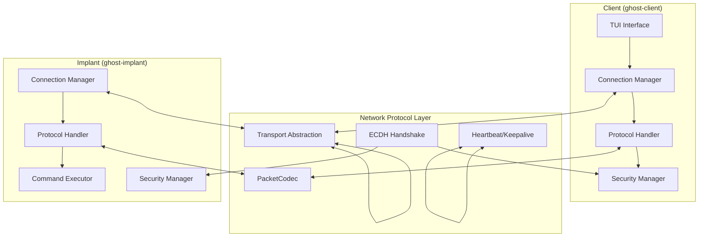

  

 [](https://github.com/unclesp1d3r/ghost_monkey/issues) 

 

# Ghost_Monkey

Ghost_Monkey is an educational UNIX backdoor written in Rust, designed for authorized penetration testing and OSCP preparation. This tool implements a modern, secure client-implant architecture using the `network-protocol` crate for encrypted communication with ECDH key exchange and ChaCha20-Poly1305 AEAD encryption.

## Overview

Ghost_Monkey is an educational project designed to demonstrate advanced concepts in network programming, cryptography, and remote access techniques. The project serves as a learning resource for understanding modern backdoor mechanisms in controlled, authorized environments.

**Current Status**: Early development phase with foundational structure in place.

## Development Roadmap

The project follows a structured development approach with detailed specifications:

- **Phase 1**: ✅ Project structure and dependencies
- **Phase 2**: 🔄 Transport layer implementation using `network-protocol`
- **Phase 3**: 🔄 Security layer with ECDH handshake and encryption
- **Phase 4**: 🔄 Application layer with command execution
- **Phase 5**: 🔄 TUI interface with ratatui
- **Phase 6**: 🔄 Cross-platform optimization and testing

See [`.kiro/specs/core-networking-protocol/tasks.md`](.kiro/specs/core-networking-protocol/tasks.md) for detailed implementation tasks.

### Planned Features

- **Modern Cryptography**: ECDH key exchange with ChaCha20-Poly1305 AEAD encryption
- **Dual Connection Modes**: Call-in (client connects to implant) and callback (implant connects to client)
- **Rich TUI Interface**: Multi-pane terminal interface built with ratatui
- **Secure Protocol**: Built on the `network-protocol` crate with packet-level encryption
- **Cross-Platform**: Maximum Rust platform support with cargo-zigbuild
- **Educational Focus**: Comprehensive documentation and code comments for learning
- **Safety-First Design**: Built-in educational warnings and safety constraints

## Architecture

The system implements a layered architecture with secure communication:



### Connection Modes

- **Call-in Mode**: Client connects to listening implant (traditional)
- **Callback Mode**: Implant connects to listening client (firewall evasion)
- **Secure Handshake**: 3-way ECDH key exchange with nonce verification
- **Encrypted Communication**: All messages encrypted with ChaCha20-Poly1305

## Requirements

- Rust ≥ 1.85 (2024 edition)
- Unix-like systems (Linux, macOS, WSL)
- Optional: Zig for cross-compilation via cargo-zigbuild

## Installation

1. **Install Rust** (if not already installed):

   ```bash
   curl --proto '=https' --tlsv1.2 -sSf https://sh.rustup.rs | sh
   ```

2. **Clone and build**:

   ```bash
   git clone https://github.com/unclesp1d3r/ghost_monkey
   cd ghost_monkey
   cargo build --release
   ```

3. **Optional: Install cross-compilation tools**:

   ```bash
   cargo install cargo-zigbuild
   ```

## Current Status

The project is currently in early development. The binaries can be built and run, but contain only placeholder implementations:

```bash
# Build the project
cargo build --release

# Run the client (placeholder)
./target/release/ghost-client
# Output: Ghost Monkey Client - Educational Tool
#         This is a placeholder implementation.

# Run the implant (placeholder)
./target/release/ghost-implant
# Output: Ghost Monkey Implant - Educational Tool
#         This is a placeholder implementation.
```

### Planned Usage (Future Implementation)

The following usage patterns are planned for future releases:

#### Call-in Mode (Client connects to Implant)

```bash
./target/release/ghost-implant --listen --port 8080
./target/release/ghost-client --connect 127.0.0.1:8080
```

#### Callback Mode (Implant connects to Client)

```bash
./target/release/ghost-client --listen --port 8080
./target/release/ghost-implant --callback 127.0.0.1:8080
```

## Planned Security Features

The following security features are planned for implementation:

- **Strong Encryption**: ChaCha20-Poly1305 AEAD with 256-bit keys
- **Perfect Forward Secrecy**: Ephemeral ECDH key exchange using X25519
- **Replay Protection**: Nonce verification and timestamp validation
- **Secure Handshake**: 3-way handshake with mutual authentication
- **Educational Safety**: Built-in warnings and restricted command execution

## Safety Guidelines

⚠️ **Educational Purpose Only**: This tool is designed for learning and authorized penetration testing.

**Recommended Practices**:

- Start with localhost (127.0.0.1) connections for initial learning
- Use isolated virtual machines or lab environments
- Run as non-privileged user when possible
- Understand ethical and legal implications before use
- Follow responsible disclosure practices

## Development

### Building

```bash
# Debug build
cargo build

# Release build (optimized)
cargo build --release

# Cross-platform builds (when implemented)
cargo install cargo-zigbuild
cargo zigbuild --target x86_64-unknown-linux-gnu
cargo zigbuild --target aarch64-apple-darwin
```

### Testing

```bash
# Run tests (currently minimal)
cargo test

# Future testing capabilities:
# cargo nextest run              # Enhanced test runner
# cargo test proptest            # Property-based testing
# cargo bench                    # Benchmarking
```

### Documentation

```bash
# Generate API documentation
cargo doc --open

# Build user guide (requires mdbook)
cargo install mdbook
mdbook build docs/
mdbook serve docs/
```

## Project Structure

```text
ghost_monkey/
├── src/
│   ├── client/         # Client implementation (placeholder)
│   │   └── main.rs     # Client entry point
│   ├── implant/        # Implant implementation (placeholder)
│   │   └── main.rs     # Implant entry point
│   └── main.rs         # Main entry point
├── docs/               # mdbook documentation (in progress)
│   └── src/            # Documentation source
├── target/             # Build artifacts
├── .kiro/              # Kiro IDE configuration
│   └── specs/          # Feature specifications and planning
├── Cargo.toml          # Project configuration
└── README.md           # This file
```

### Planned Structure (Future Implementation)

The following structure is planned as development progresses:

```text
src/
├── transport/      # Transport layer (network-protocol)
├── protocol/       # Protocol definitions
├── crypto/         # Cryptographic operations
├── shell/          # Interactive shell support
└── lib.rs          # Shared library code
```

## Contributing

This project follows specific development patterns and safety guidelines. See [CONTRIBUTING.md](CONTRIBUTING.md) for detailed contribution guidelines.

## License

This project is licensed under the terms specified in [LICENSE](LICENSE).

## Disclaimer

This tool is designed for educational purposes, authorized penetration testing, and OSCP preparation. Users are responsible for ensuring they have proper authorization before using this tool in any environment. Use responsibly and in accordance with applicable laws and regulations.

## Authors

- [@UncleSp1d3r](https://www.github.com/unclesp1d3r)
