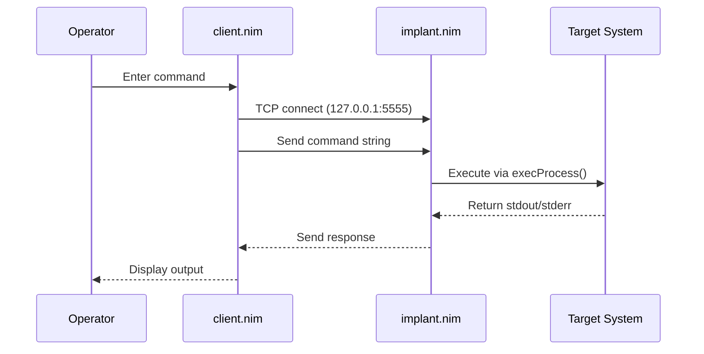

## Badges


# Ghost_Monkey

Ghost_Monkey is an educational UNIX backdoor written in Nim, designed for authorized penetration testing and OSCP preparation. This tool implements a simple client-server architecture using TCP sockets for remote command execution.

## Overview

Ghost_Monkey provides a lightweight backdoor implementation that demonstrates fundamental concepts in network programming and remote access techniques. The project serves as an educational resource for understanding backdoor mechanisms in controlled, authorized environments.

### Key Features

- **Simple TCP Protocol**: Unauthenticated socket-based communication
- **Cross-Platform**: Built with Nim for Unix-like systems
- **Educational Focus**: Clean, readable code for learning purposes
- **Minimal Dependencies**: Uses only standard Nim libraries and `strenc` module

## Architecture

The system consists of two main components:



- **[client.nim](client.nim)**: Interactive socket client for command input
- **[implant.nim](implant.nim)**: Socket server that executes commands via `execProcess()`

## Requirements

- Nim ≥ 2.0
- `strenc` package (install via `nimble install strenc`)
- Unix-like operating system

## Installation

1. **Install Nim** (if not already installed):

   ```bash
   curl https://nim-lang.org/choosenim/init.sh -sSf | sh
   ```

2. **Install dependencies**:

   ```bash
   nimble install strenc
   ```

3. **Build the project**:

   ```bash
   nimble build
   ```

## Usage

### Starting the Implant

```bash
./implant [port]  # Default port: 5555
```

### Connecting with Client

```bash
./client  # Connects to 127.0.0.1:5555
```

### Example Session

```bash
$ ./implant
Listening on 127.0.0.1:5555

$ ./client
Connected to 127.0.0.1:5555
> whoami
user
> pwd
/home/user
> exit
```

## Security Considerations

- **No Authentication**: The protocol is unauthenticated by design
- **Plain Text**: Communications are not encrypted
- **Local Testing**: Always bind to 127.0.0.1 for testing
- **Non-Privileged**: Run as non-root user for safety

## Development

### Building

```bash
# Debug build
nimble build

# Release build
nimble build -d:release
```

### Testing

Run tests in isolated environments only:

```bash
# Run unit tests
nimble test

# Manual integration testing
./implant &
IMPLANT_PID=$!
./client
# Test with benign commands
kill $IMPLANT_PID
```

## Project Structure

```text
ghost_monkey/
├── src/
│   ├── client.nim      # Socket client implementation
│   └── implant.nim     # Socket server implementation
├── tests/
│   ├── test_client.nim     # Client unit tests
│   ├── test_implant.nim    # Implant unit tests
│   └── test_integration.nim # Integration tests
├── docs/
│   └── ARCHITECTURE.md # Detailed architecture documentation
├── ghost_monkey.nimble # Nim package configuration
├── AGENTS.md           # Development guidelines
├── CONTRIBUTING.md     # Contribution guidelines
└── README.md           # This file
```

## Contributing

This project follows specific development patterns and safety guidelines. See [AGENTS.md](AGENTS.md) for detailed contribution guidelines.

## License

This project is licensed under the terms specified in [LICENSE](LICENSE).

## Disclaimer

This tool is designed for educational purposes, authorized penetration testing, and OSCP preparation. Users are responsible for ensuring they have proper authorization before using this tool in any environment. Use responsibly and in accordance with applicable laws and regulations.

## Authors

- [@UncleSp1d3r](https://www.github.com/unclesp1d3r)
