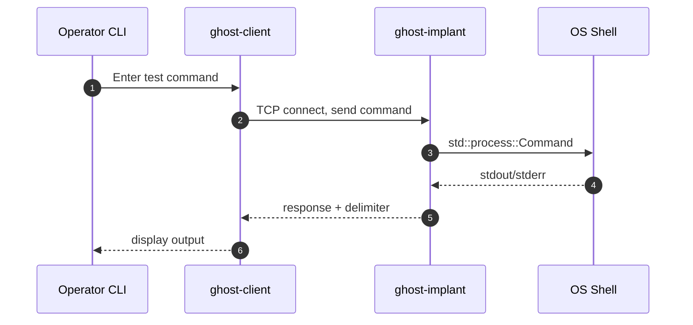

# Ghost_Monkey Rust Implementation Specification

## Overview

This document provides a comprehensive specification for rewriting the Ghost_Monkey educational backdoor back to Rust. **Ghost_Monkey is actually based on the original Rust project `ghost_shell` (<https://crates.io/crates/ghost_shell>)**, which was later ported to Nim for learning purposes. This specification returns to the Rust roots while incorporating lessons learned from the Nim implementation and leveraging Rust's memory safety, cross-platform support, and rich ecosystem.

### Project History

- **Original**: `ghost_shell` - Rust implementation (<https://github.com/unclesp1d3r/ghost_shell>)
- **Port**: `ghost_monkey` - Nim learning implementation
- **Return**: `ghost_monkey` v0.2+ - Back to Rust with improvements

## Project Purpose and Constraints

**Educational Use Only**: This tool is strictly for authorized penetration testing, OSCP preparation, and educational purposes. Users are solely responsible for ensuring lawful use with explicit consent from system owners.

**Safety Requirements**:

- All testing must be conducted on localhost (127.0.0.1) only
- No persistence, privilege escalation, or stealth features
- Clear ethical boundaries and responsible disclosure practices

## Current Implementation Analysis

### Nim Implementation Details

**Client (client.nim)**:

- Connects to hardcoded `127.0.0.1:5555`
- Simple REPL interface with `>` prompt
- Sends commands terminated with `\r\n`
- Receives multi-line responses until empty line `\r\n`
- Exit command: `quit`
- Uses `strenc` module (purpose unclear)

**Implant (implant.nim)**:

- Accepts optional port argument (defaults to 5555)
- Single-client accept model (no concurrent connections)
- Executes commands via `execProcess()`
- Sends results terminated with `\r\n`
- Basic exception handling with connection loss detection
- Uses `strenc` module (purpose unclear)

**Protocol Analysis**:

- Plain text TCP communication
- No authentication or encryption
- Simple line-based protocol with `\r\n` terminators
- Client sends: `COMMAND\r\n`
- Server responds: `RESULT\r\n`
- Multi-line responses end with empty line `\r\n`

## Rust Implementation Specification

### Architecture Overview



### Project Structure

```text
ghost_monkey_rust/
├── Cargo.toml
├── Cargo.lock
├── src/
│   ├── lib.rs                 # Shared protocol and utilities
│   ├── client/
│   │   ├── main.rs           # Client binary entry point
│   │   └── mod.rs            # Client implementation
│   ├── implant/
│   │   ├── main.rs           # Implant binary entry point
│   │   └── mod.rs            # Implant implementation
│   └── protocol/
│       ├── mod.rs            # Protocol definitions
│       └── message.rs        # Message types and serialization
├── tests/
│   ├── integration_tests.rs  # End-to-end tests
│   ├── client_tests.rs       # Client unit tests
│   └── implant_tests.rs      # Implant unit tests
├── benches/                  # Benchmark tests
├── examples/                 # Usage examples
├── docs/                     # Additional documentation
├── scripts/                  # Build and test scripts
├── justfile                  # Task automation
└── README.md
```

### Component Specifications

#### 1. Client Component (`ghost-client`)

**Functional Requirements**:

- Interactive REPL interface with customizable prompt
- Connect to specified host:port (default: 127.0.0.1:5555)
- Send commands and display responses
- Handle multi-line responses correctly
- Graceful connection handling and error reporting
- Support for quit/exit commands

**Technical Specifications**:

```rust
// Client configuration
struct ClientConfig {
    host: String,           // Default: "127.0.0.1"
    port: u16,              // Default: 5555
    prompt: String,         // Default: "> "
    timeout: Duration,      // Connection timeout
}

// Client main loop
async fn run_client(config: ClientConfig) -> Result<(), ClientError>;
```

**CLI Interface**:

```bash
ghost-client [OPTIONS]

OPTIONS:
    -h, --host <HOST>       Target host [default: 127.0.0.1]
    -p, --port <PORT>       Target port [default: 5555]
    -t, --timeout <SECS>    Connection timeout [default: 10]
    --prompt <PROMPT>       Command prompt [default: "> "]
    --help                  Show help information
    --version               Show version information
```

#### 2. Implant Component (`ghost-implant`)

**Functional Requirements**:

- Bind to specified port (default: 5555, loopback only)
- Accept single client connection
- Execute received commands safely
- Return stdout/stderr with proper delimiter
- Handle connection errors gracefully
- Logging for debugging (non-sensitive)

**Technical Specifications**:

```rust
// Implant configuration
struct ImplantConfig {
    port: u16,              // Binding port
    bind_host: String,      // Default: "127.0.0.1" (security)
    max_output: usize,      // Max command output size
    timeout: Duration,      // Command execution timeout
}

// Command execution with safety limits
async fn execute_command(cmd: &str, config: &ImplantConfig)
    -> Result<String, ExecutionError>;
```

**CLI Interface**:

```bash
ghost-implant [OPTIONS]

OPTIONS:
    -p, --port <PORT>           Bind port [default: 5555]
    --bind-host <HOST>          Bind address [default: 127.0.0.1]
    --max-output <BYTES>        Max command output [default: 1MB]
    --timeout <SECS>            Command timeout [default: 30]
    -v, --verbose               Verbose logging
    --help                      Show help information
    --version                   Show version information
```

### 3. Protocol Specification

**Message Format**:

```rust
// Protocol constants
pub const PROTOCOL_VERSION: u8 = 1;
pub const MESSAGE_DELIMITER: &str = "\r\n";
pub const END_OF_RESPONSE: &str = "\r\n";
pub const MAX_COMMAND_LENGTH: usize = 8192;
pub const MAX_RESPONSE_LENGTH: usize = 1048576; // 1MB

// Message types
#[derive(Debug, Clone)]
pub enum Message {
    Command(String),
    Response(String),
    Error(String),
    Quit,
}

// Protocol implementation
pub struct Protocol;
impl Protocol {
    pub fn serialize_message(msg: &Message) -> Vec<u8>;
    pub fn deserialize_message(data: &[u8]) -> Result<Message, ProtocolError>;
}
```

**Connection Flow**:

1. Client connects to implant
2. Client sends command: `COMMAND\r\n`
3. Implant executes command
4. Implant sends response: `RESPONSE\r\n`
5. For multi-line responses, implant ends with `\r\n`
6. Repeat until client sends quit command or connection closes

### 4. Recommended Rust Dependencies

**Core Dependencies**:

```toml
[dependencies]
# CLI and configuration
clap = { version = "4.0", features = ["derive"] }
serde = { version = "1.0", features = ["derive"] }
toml = "0.8"

# Networking and async runtime
tokio = { version = "1.0", features = ["full"] }
tokio-util = { version = "0.7", features = ["codec"] }

# Process execution
tokio-process = "0.2"

# Error handling and logging
anyhow = "1.0"
thiserror = "1.0"
tracing = "0.1"
tracing-subscriber = "0.3"

# Cross-platform utilities
dirs = "5.0"

[dev-dependencies]
# Testing
tokio-test = "0.4"
assert_cmd = "2.0"
predicates = "3.0"
tempfile = "3.0"

# Benchmarking
criterion = { version = "0.5", features = ["html_reports"] }
```

### 5. Security and Safety Requirements

**Memory Safety**:

- Leverage Rust's ownership system for buffer safety
- Use bounded collections for command/response handling
- Implement proper resource cleanup (RAII)

**Input Validation**:

```rust
// Command validation
fn validate_command(cmd: &str) -> Result<(), ValidationError> {
    if cmd.len() > MAX_COMMAND_LENGTH {
        return Err(ValidationError::TooLong);
    }
    if cmd.trim().is_empty() {
        return Err(ValidationError::Empty);
    }
    // Additional validation as needed
    Ok(())
}

// Response size limiting
fn limit_response_size(output: Vec<u8>) -> Vec<u8> {
    if output.len() > MAX_RESPONSE_LENGTH {
        let truncated = &output[..MAX_RESPONSE_LENGTH-50];
        let mut result = Vec::from(truncated);
        result.extend_from_slice(b"\n[OUTPUT TRUNCATED]\n");
        result
    } else {
        output
    }
}
```

**Network Security**:

- Enforce localhost-only binding for implant
- Implement connection timeouts
- Rate limiting for command execution
- Proper connection cleanup

### 6. Error Handling Strategy

**Error Types**:

```rust
// Client errors
#[derive(thiserror::Error, Debug)]
pub enum ClientError {
    #[error("Connection failed: {0}")]
    Connection(#[from] std::io::Error),
    #[error("Protocol error: {0}")]
    Protocol(#[from] ProtocolError),
    #[error("Command too long")]
    CommandTooLong,
}

// Implant errors
#[derive(thiserror::Error, Debug)]
pub enum ImplantError {
    #[error("Bind failed: {0}")]
    Bind(#[from] std::io::Error),
    #[error("Command execution failed: {0}")]
    Execution(String),
    #[error("Protocol error: {0}")]
    Protocol(#[from] ProtocolError),
}

// Protocol errors
#[derive(thiserror::Error, Debug)]
pub enum ProtocolError {
    #[error("Invalid message format")]
    InvalidFormat,
    #[error("Message too large")]
    MessageTooLarge,
    #[error("Unsupported protocol version")]
    UnsupportedVersion,
}
```

### 7. Testing Strategy

**Unit Tests**:

- Protocol serialization/deserialization
- Command validation logic
- Error handling paths
- Cross-platform compatibility

**Integration Tests**:

```rust
// Example integration test
#[tokio::test]
async fn test_basic_command_execution() {
    // Start implant on ephemeral port
    let implant = spawn_test_implant().await;
    let port = implant.port();

    // Connect client and execute benign command
    let client = TestClient::connect("127.0.0.1", port).await.unwrap();
    let response = client.execute_command("echo hello").await.unwrap();

    assert_eq!(response.trim(), "hello");

    // Clean shutdown
    client.quit().await.unwrap();
    implant.shutdown().await;
}
```

**Property-Based Tests**:

```rust
// Example property test with quickcheck
#[quickcheck]
fn protocol_roundtrip(msg: Message) -> bool {
    let serialized = Protocol::serialize_message(&msg);
    let deserialized = Protocol::deserialize_message(&serialized).unwrap();
    msg == deserialized
}
```

### 8. Build and Deployment

**Cargo.toml Configuration**:

```toml
[package]
name = "ghost_monkey"
version = "0.2.0"
edition = "2021"
authors = ["UncleSp1d3r"]
description = "Educational backdoor for authorized penetration testing (Rust implementation)"
license = "MIT"
repository = "https://github.com/unclesp1d3r/ghost_monkey"

[[bin]]
name = "ghost-client"
path = "src/client/main.rs"

[[bin]]
name = "ghost-implant"
path = "src/implant/main.rs"

[profile.release]
lto = true
codegen-units = 1
panic = "abort"
strip = true

[profile.dev]
debug = true
```

**Cross-Platform Builds**:

```bash
# Common targets for educational use
cargo build --target x86_64-unknown-linux-gnu
cargo build --target x86_64-pc-windows-gnu
cargo build --target x86_64-apple-darwin
cargo build --target aarch64-apple-darwin
```

### 9. justfile Integration

**Updated justfile for Rust**:

```make
set positional-arguments := true

# Default recipe lists available commands
default:
    @just --list

# Lint justfile formatting
lint-just:
    just --fmt --check --unstable

# Install Rust toolchain and dependencies
deps:
    rustup update
    cargo fetch

# Build both binaries in debug mode
build:
    cargo build

# Build both binaries in release mode
build-release:
    cargo build --release

# Internal helper for building specific binary
_cargo-build binary mode="":
    cargo build {{mode}} --bin {{binary}}

# Build client only
build-client mode="":
    @just _cargo-build ghost-client {{mode}}

# Build implant only
build-implant mode="":
    @just _cargo-build ghost-implant {{mode}}

# Run all tests
test:
    cargo test

# Run tests with coverage
test-coverage:
    cargo tarpaulin --out Html

# Run integration tests only
test-integration:
    cargo test --test integration_tests

# Run linting and formatting checks
lint:
    cargo clippy -- -D warnings
    cargo fmt --check

# Fix formatting issues
fmt:
    cargo fmt

# Clean build artifacts
clean:
    cargo clean

# Run security audit
audit:
    cargo audit

# Generate documentation
docs:
    cargo doc --open

# Run benchmarks
bench:
    cargo bench

[unix]
# Run local integration test (Unix)
test-local:
    @just build
    ./scripts/test_local.sh

[windows]
# Run local integration test (Windows)
test-local:
    @just build
    ./scripts/test_local.ps1
```

### 10. Migration Considerations

**Functional Parity**:

- [ ] Client REPL interface
- [ ] Command execution via implant
- [ ] Multi-line response handling
- [ ] Connection error handling
- [ ] Port configuration
- [ ] Quit command functionality

**Improvements Over Nim Version**:

- Strong type safety and memory safety
- Better error handling and reporting
- Configurable timeouts and limits
- Comprehensive testing suite
- Cross-platform binary distribution
- Security hardening (input validation, output limiting)
- Structured logging for debugging

**Performance Considerations**:

- Async/await for non-blocking I/O
- Efficient string handling for large responses
- Connection pooling (if multi-client support added later)
- Memory-mapped I/O for large file operations

### 11. Development Phases

**Phase 1: Core Implementation**

1. Set up Cargo workspace structure
2. Implement basic protocol module
3. Create minimal client binary
4. Create minimal implant binary
5. Basic integration tests

**Phase 2: Feature Completion**

1. CLI argument parsing
2. Configuration management
3. Error handling refinement
4. Logging integration
5. Comprehensive test suite

**Phase 3: Hardening**

1. Security reviews and input validation
2. Performance benchmarking
3. Cross-platform testing
4. Documentation completion
5. Release preparation

**Phase 4: Documentation and Distribution**

1. User guides and tutorials
2. Cross-compilation setup
3. Release automation
4. Security advisory documentation

### 12. Acceptance Criteria

**Functional Requirements**:

- [ ] Client connects to implant successfully
- [ ] Commands execute and return output
- [ ] Multi-line responses handled correctly
- [ ] Error conditions handled gracefully
- [ ] Client can quit cleanly
- [ ] Implant shuts down properly on connection loss

**Non-Functional Requirements**:

- [ ] Memory safe (no crashes or buffer overflows)
- [ ] Cross-platform compatibility (Linux, macOS, Windows)
- [ ] Comprehensive test coverage (>90%)
- [ ] Clear error messages and logging
- [ ] Educational documentation and examples
- [ ] Security-conscious defaults (localhost-only)

**Development Quality**:

- [ ] Passes `cargo clippy` with no warnings
- [ ] Consistent code formatting with `rustfmt`
- [ ] All tests pass in CI/CD pipeline
- [ ] Security audit passes with no high-severity findings
- [ ] Performance meets or exceeds Nim implementation

This specification provides a complete roadmap for implementing Ghost_Monkey in Rust while maintaining educational value and improving security, maintainability, and cross-platform support.
