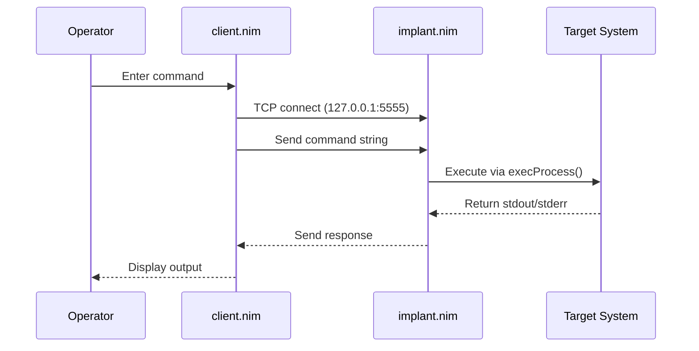

# Architecture

This document provides a detailed overview of the Ghost_Monkey architecture and design decisions.

## System Overview

Ghost_Monkey implements a simple client-server backdoor pattern using TCP sockets for educational purposes. The system consists of two main components that communicate via an unauthenticated socket protocol.

## Architecture Diagram



## Component Design

### Client (src/client.nim)

The client component provides an interactive interface for command input and output display.

**Responsibilities:**

- Establish TCP connection to implant
- Send command strings to implant
- Receive and display command output
- Handle connection errors gracefully

**Key Functions:**

- Connection management
- Command transmission
- Output display
- Error handling

### Implant (src/implant.nim)

The implant component acts as a socket server that executes received commands.

**Responsibilities:**

- Listen for incoming TCP connections
- Execute received commands via `execProcess()`
- Return command output to client
- Handle multiple connections (if implemented)

**Key Functions:**

- Socket server initialization
- Command execution
- Output transmission
- Connection cleanup

## Protocol Design

### Communication Protocol

The protocol is intentionally simple and unauthenticated for educational purposes:

1. **Connection**: Client connects to implant on port 5555
2. **Command Transmission**: Client sends command string
3. **Execution**: Implant executes command via `execProcess()`
4. **Response**: Implant returns stdout/stderr to client
5. **Display**: Client displays output to operator

### Message Format

- **Command**: Plain text string
- **Response**: Plain text output from command execution
- **No Encryption**: Communications are not encrypted
- **No Authentication**: No authentication mechanism

## Security Considerations

### Design Decisions

- **No Authentication**: Simplified for educational purposes
- **Plain Text**: No encryption to demonstrate basic concepts
- **Local Testing**: Designed for loopback testing only
- **No Persistence**: No startup scripts or service installation

### Safety Measures

- **Loopback Binding**: Always bind to 127.0.0.1
- **Non-Privileged**: Run as non-root user
- **Isolated Testing**: Use isolated test environments
- **Clean Shutdown**: Proper connection cleanup

## Dependencies

### Core Dependencies

- **Nim Standard Library**: Socket programming, process execution
- **strenc**: String encoding/decoding utilities
- **POSIX**: Unix system calls and process management

### External Dependencies

- **Nim ≥ 2.0**: Programming language runtime
- **Unix-like OS**: Target operating system

## File Structure

```
src/
├── client.nim          # Socket client implementation
└── implant.nim         # Socket server implementation

tests/
├── test_client.nim     # Client unit tests
├── test_implant.nim    # Implant unit tests
└── test_integration.nim # Integration tests

docs/
└── ARCHITECTURE.md     # This document
```

## Development Guidelines

### Code Organization

- **Single Responsibility**: Each component has a clear purpose
- **Minimal Dependencies**: Use only necessary external packages
- **Clean Interfaces**: Simple, well-defined component interfaces
- **Error Handling**: Graceful error handling throughout

### Testing Strategy

- **Unit Tests**: Test individual components in isolation
- **Integration Tests**: Test client-implant communication
- **Safety Tests**: Verify security constraints are maintained
- **Isolated Environment**: All tests run in controlled environments

## Future Considerations

### Potential Enhancements

- **Authentication**: Add basic authentication
- **Encryption**: Add transport encryption
- **Logging**: Add audit logging capabilities
- **Configuration**: Add configuration file support

### Educational Value

The current design prioritizes:

- **Simplicity**: Easy to understand and modify
- **Clarity**: Clear separation of concerns
- **Safety**: Built-in safety constraints
- **Learning**: Demonstrates fundamental concepts

## Conclusion

Ghost_Monkey's architecture is designed for educational purposes, emphasizing simplicity, clarity, and safety. The system demonstrates fundamental backdoor concepts while maintaining appropriate security constraints for educational use.
