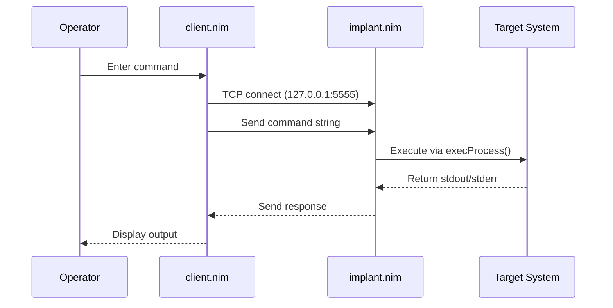

# Ghost_Monkey


Ghost_Monkey is an educational UNIX backdoor written in Nim, designed for authorized penetration testing and OSCP preparation. This tool implements a simple client-server architecture using TCP sockets for remote command execution.

## Overview

Ghost_Monkey provides a lightweight backdoor implementation that demonstrates fundamental concepts in network programming and remote access techniques. The project serves as an educational resource for understanding backdoor mechanisms in controlled, authorized environments.

### Key Features

- **Simple TCP Protocol**: Unauthenticated socket-based communication
- **Cross-Platform**: Built with Nim for Unix-like systems
- **Educational Focus**: Clean, readable code for learning purposes
- **Minimal Dependencies**: Uses only standard Nim libraries and `strenc` module

## Architecture

The system consists of two main components:



- **[client.nim](src/client.nim)**: Interactive socket client for command input
- **[implant.nim](src/implant.nim)**: Socket server that executes commands via `execProcess()`

## Quick Start

1. **Install Nim** (if not already installed):

   ```bash
   curl https://nim-lang.org/choosenim/init.sh -sSf | sh
   ```

2. **Install dependencies**:

   ```bash
   nimble install strenc
   ```

3. **Build the project**:

   ```bash
   nimble build
   ```

4. **Run the implant**:

   ```bash
   ./implant [port]  # Default port: 5555
   ```

5. **Connect with client**:

   ```bash
   ./client  # Connects to 127.0.0.1:5555
   ```

## Security Considerations

!!! warning "Important Safety Notice"
    This tool is designed for educational purposes, authorized penetration testing, and OSCP preparation. Users are responsible for ensuring they have proper authorization before using this tool in any environment.

- **No Authentication**: The protocol is unauthenticated by design
- **Plain Text**: Communications are not encrypted
- **Local Testing**: Always bind to 127.0.0.1 for testing
- **Non-Privileged**: Run as non-root user for safety

## Contributing

This project follows specific development patterns and safety guidelines. See the [Contributing Guide](contributing.md) for detailed contribution guidelines.

## License

This project is licensed under the terms specified in [LICENSE](../LICENSE).

## Authors

- [@UncleSp1d3r](https://www.github.com/unclesp1d3r)
