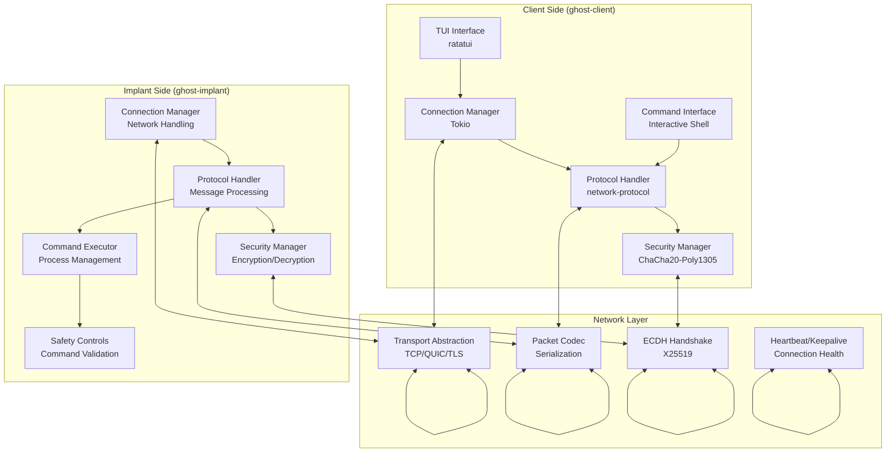
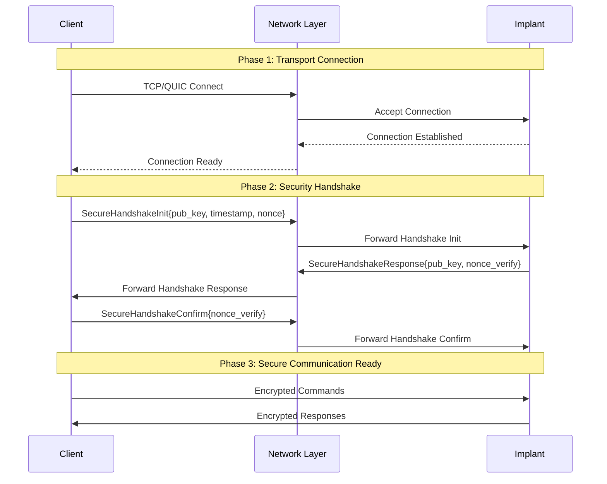
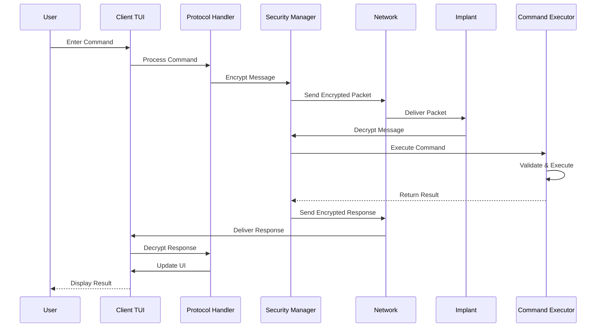
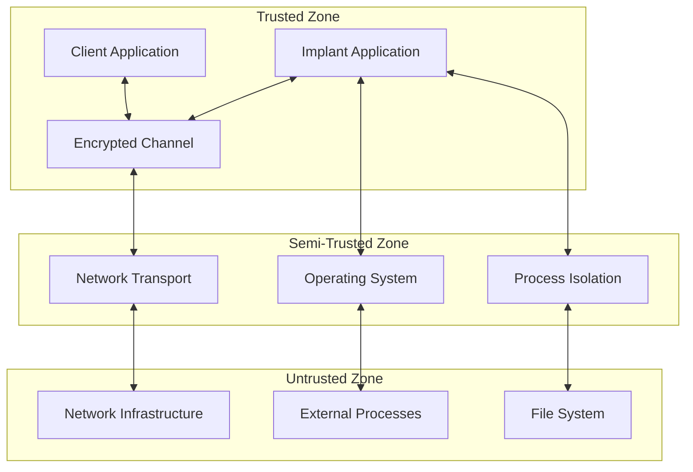

# System Overview

Ghost Monkey is designed to implement a modern, secure client-implant architecture for educational purposes and authorized penetration testing. This chapter provides an overview of the planned system design principles, components, and architecture.

**Current Status**: The project is in early development with foundational structure and planning in place. The implementation described here represents the target architecture.

## Design Philosophy

### Security-First Approach

Ghost Monkey prioritizes security through:

- **Defense in Depth**: Multiple layers of security controls
- **Principle of Least Privilege**: Minimal required permissions
- **Secure by Default**: Safe configuration out of the box
- **Cryptographic Best Practices**: Modern, proven algorithms

### Educational Focus

The system is designed to teach:

- **Modern Cryptography**: Real-world encryption and key exchange
- **Network Programming**: Secure client-server communication
- **System Security**: Understanding attack and defense mechanisms
- **Ethical Hacking**: Responsible security testing practices

## High-Level Architecture



## Core Components

### Client (ghost-client)

The client will provide the user interface and initiate communication:

**Planned Responsibilities:**

- Rich terminal user interface (TUI) using ratatui
- Connection management (both call-in and callback modes)
- Command input and response display
- Security handshake initiation
- Real-time status monitoring

**Planned Components:**

```rust
// Planned client application structure
pub struct ClientApp {
    connection_manager: ConnectionManager,
    protocol_handler: ProtocolHandler,
    ui_state: UIState,
    command_history: Vec<String>,
}
```

**Current Implementation**: Basic placeholder that displays educational message.

### Implant (ghost-implant)

The implant will execute commands and respond to client requests:

**Planned Responsibilities:**

- Secure command execution with safety controls
- Connection handling (listen and callback modes)
- Response generation and transmission
- Educational safety warnings
- Resource management and limits

**Planned Components:**

```rust
// Planned implant application structure
pub struct ImplantApp {
    connection_manager: ConnectionManager,
    protocol_handler: ProtocolHandler,
    command_executor: CommandExecutor,
    safety_controls: SafetyControls,
}
```

**Current Implementation**: Basic placeholder that displays educational message.

### Network Protocol Layer

Will be built on the `network-protocol` crate, providing:

**Transport Abstraction:**

- TCP transport for reliable communication
- QUIC transport for modern, encrypted communication
- TLS transport for additional encryption layer
- Automatic connection management and recovery

**Packet Handling:**

- Structured message serialization/deserialization
- Automatic fragmentation and reassembly
- Error detection and correction
- Flow control and congestion management

### Security Layer

Will implement modern cryptographic protocols:

**Key Exchange:**

- X25519 Elliptic Curve Diffie-Hellman (ECDH)
- Perfect Forward Secrecy (PFS)
- Ephemeral key generation
- Nonce-based replay protection

**Encryption:**

- ChaCha20-Poly1305 Authenticated Encryption with Associated Data (AEAD)
- 256-bit keys for maximum security
- Automatic nonce generation and management
- Integrity verification for all messages

## Data Flow

### Connection Establishment



### Command Execution Flow



## Security Model

### Threat Model

**Protected Against:**

- Network eavesdropping (encryption)
- Man-in-the-middle attacks (authentication)
- Replay attacks (nonce verification)
- Command injection (input validation)
- Privilege escalation (user-level execution)

**Educational Limitations:**

- No stealth or evasion features
- Built-in safety warnings
- Restricted command set
- Localhost-focused testing

### Trust Boundaries



## Performance Characteristics

### Latency Profile

- **Handshake**: ~10-50ms (depending on network)
- **Command Execution**: ~1-100ms (depending on command)
- **Encryption/Decryption**: \<1ms (ChaCha20-Poly1305 is fast)
- **Network Round-trip**: Variable (network dependent)

### Throughput Capabilities

- **Small Messages**: 10,000+ messages/second
- **Large Responses**: Limited by network bandwidth
- **Concurrent Connections**: Hundreds (limited by system resources)

### Resource Usage

- **Memory**: ~10-50MB per connection
- **CPU**: Minimal (async I/O, efficient crypto)
- **Network**: Depends on command output size
- **Disk**: Minimal (no persistence by design)

## Scalability Considerations

### Single Connection Model

Ghost Monkey is designed for one-to-one communication:

- One client connects to one implant
- Simple state management
- Focused educational experience
- Clear security boundaries

### Future Extensibility

The architecture supports future enhancements:

- Multiple transport protocols
- Additional encryption algorithms
- Extended command sets
- Advanced TUI features

## Error Handling Strategy

### Layered Error Handling

```rust
// Error hierarchy
pub enum GhostMonkeyError {
    Transport(TransportError),
    Protocol(ProtocolError),
    Security(SecurityError),
    Command(CommandError),
    UI(UIError),
}
```

### Recovery Mechanisms

- **Connection Failures**: Automatic reconnection with backoff
- **Encryption Errors**: Re-establish secure channel
- **Command Failures**: Graceful error reporting
- **UI Errors**: Fallback to basic interface

## Configuration Management

### Default Configuration

```rust
pub struct Config {
    pub network: NetworkConfig,
    pub security: SecurityConfig,
    pub ui: UIConfig,
    pub safety: SafetyConfig,
}

impl Default for Config {
    fn default() -> Self {
        Self {
            network: NetworkConfig {
                bind_addr: "127.0.0.1:8080".parse().unwrap(),
                connect_timeout: Duration::from_secs(30),
                io_timeout: Duration::from_secs(60),
            },
            security: SecurityConfig {
                heartbeat_interval: Duration::from_secs(30),
                max_message_size: 4096,
                idle_timeout: Duration::from_secs(300),
            },
            ui: UIConfig {
                refresh_rate: Duration::from_millis(100),
                enable_mouse: true,
                color_scheme: ColorScheme::Dark,
            },
            safety: SafetyConfig {
                allowed_commands: vec!["ls".to_string()],
                max_command_length: 256,
                execution_timeout: Duration::from_secs(30),
            },
        }
    }
}
```

## Next Steps

Now that you understand the overall architecture, let's dive deeper into specific components:

- [Client-Implant Model](./client-implant.md) - Detailed component interaction
- [Connection Modes](./connection-modes.md) - Call-in vs callback modes
- [Transport Layer](./transport-layer.md) - Network communication details
- [Protocol Stack](./protocol-stack.md) - Message handling and security
