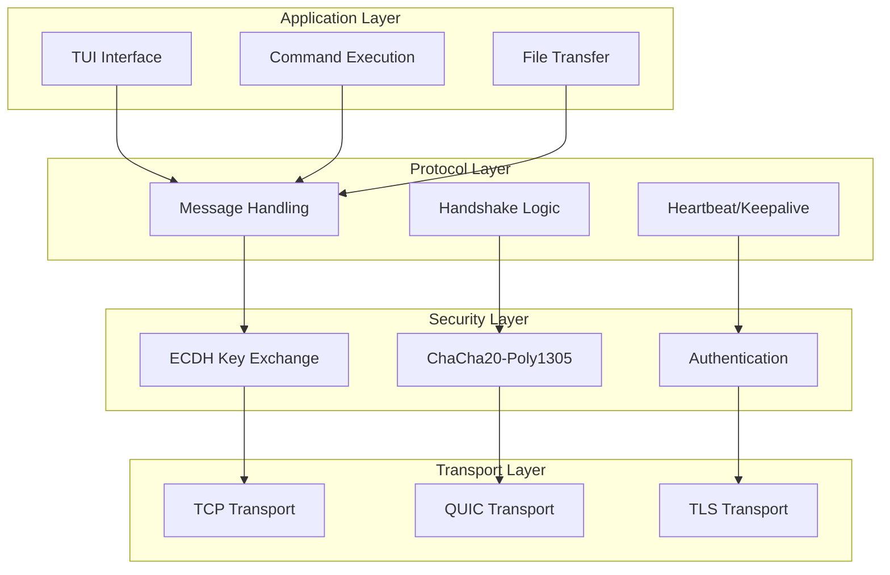

# Introduction

Welcome to the Ghost Monkey User Guide! This comprehensive documentation covers everything you need to know about Ghost Monkey, an educational UNIX backdoor written in Rust for authorized penetration testing and OSCP preparation.

## What is Ghost Monkey?

Ghost Monkey is an educational project designed to demonstrate advanced concepts in:

- **Network Programming**: TCP and QUIC transport protocols
- **Cryptography**: ChaCha20-Poly1305 AEAD encryption with ECDH key exchange
- **System Programming**: Cross-platform process execution and terminal emulation
- **Security Engineering**: Secure handshake protocols and authentication mechanisms

**Current Status**: The project is in early development with foundational structure and comprehensive planning in place.

## Educational Purpose

⚠️ **Important**: Ghost Monkey is designed exclusively for educational purposes, authorized penetration testing, and OSCP preparation. This tool should only be used in controlled environments with proper authorization.

### Learning Objectives

By studying and contributing to Ghost Monkey's development, you will learn:

1. **Modern Cryptographic Protocols**: Understanding ECDH key exchange, AEAD encryption, and perfect forward secrecy
2. **Network Programming**: Implementing secure client-server communication with multiple transport options
3. **Cross-Platform Development**: Building and deploying Rust applications across different operating systems
4. **Security Best Practices**: Implementing secure communication protocols and defensive programming techniques
5. **Penetration Testing Concepts**: Understanding backdoor mechanisms and evasion techniques

## Planned Features

### Security Features

- **Strong Encryption**: ChaCha20-Poly1305 AEAD with 256-bit keys
- **Perfect Forward Secrecy**: Ephemeral ECDH key exchange using X25519
- **Replay Protection**: Nonce verification and timestamp validation
- **Secure Handshake**: 3-way handshake with mutual authentication

### Connection Modes

- **Call-in Mode**: Traditional client connects to listening implant
- **Callback Mode**: Implant connects to listening client (firewall evasion)

### User Interface

- **Rich TUI**: Multi-pane terminal interface built with ratatui
- **Real-time Updates**: Live connection status and command output
- **Interactive Shell**: Full PTY support with terminal emulation

### Cross-Platform Support

- **Maximum Compatibility**: Supports all major Rust target platforms
- **Advanced Cross-Compilation**: Uses cargo-zigbuild for superior cross-platform builds
- **Universal Binaries**: Support for macOS universal2 binaries

### Current Implementation

The project currently includes:

- Basic project structure with Cargo.toml configuration
- Placeholder binary implementations for client and implant
- Comprehensive development dependencies and tooling setup
- Detailed planning and specification documents
- Foundation for cross-platform development with cargo-zigbuild support

## Architecture Overview

Ghost Monkey implements a layered architecture:

## Documentation Structure

This guide is organized into several sections:

- **Getting Started**: Installation, first run, and safety guidelines
- **Architecture**: Deep dive into system design and components
- **Networking**: Transport protocols and network programming concepts
- **Cryptography**: Encryption, key exchange, and authentication mechanisms
- **Implementation**: Code walkthrough and development details
- **Cross-Platform**: Building and deploying across different platforms
- **Security**: Threat modeling, defensive measures, and ethical considerations
- **Exercises**: Practical tutorials and OSCP preparation scenarios
- **Advanced Topics**: Extending the system and contributing to development

## Prerequisites

To get the most out of this guide, you should have:

- **Basic Rust Knowledge**: Understanding of Rust syntax, ownership, and async programming
- **Network Programming Concepts**: Familiarity with TCP/IP, sockets, and client-server architecture
- **Security Awareness**: Basic understanding of cryptography and security principles
- **System Administration**: Comfort with command-line interfaces and system tools

## Getting Help

If you encounter issues or have questions:

1. Check the [Troubleshooting](./appendices/troubleshooting.md) section
2. Review the [API Reference](./appendices/api-reference.md)
3. Consult the [Glossary](./appendices/glossary.md) for terminology
4. Visit the project repository for the latest updates

## Legal and Ethical Notice

Before proceeding, please read and understand the [Legal Disclaimer](./appendices/legal-disclaimer.md) and [Ethical Considerations](./ch07-security/ethical-considerations.md). This tool is provided for educational purposes only, and users are responsible for ensuring they have proper authorization before use.

---

Ready to begin? Let's start with [Installation](./ch01-getting-started/installation.md)!
